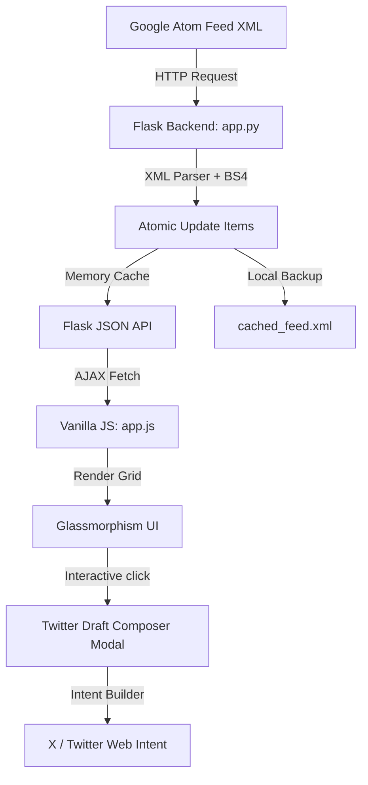

# BigQuery Release Notes Explorer: Project Architecture

A high-fidelity dashboard built with **Python Flask** and **Vanilla Web Languages** (HTML5, CSS3, JavaScript) that parses and manages BigQuery release notes. It fetches the official Google Atom feed, separates entries into atomic release updates, lists them in a glassmorphic dashboard, and provides a custom composer drawer to tweet about individual updates.

## Technical Design & Architecture

### Component Structure

- [app.py](file:///C:/Users/osman/OneDrive/Desktop/KAGGLEDAN%20GELDIK,%20ANTIGRAVITY%20PROJELERI/2.gun/agy-cli-projects/bq-releases-notes/app.py): Handles the feed fetching, offline fallback cache, XML tag namespace decoding, and item parsing.
- [index.html](file:///C:/Users/osman/OneDrive/Desktop/KAGGLEDAN%20GELDIK,%20ANTIGRAVITY%20PROJELERI/2.gun/agy-cli-projects/bq-releases-notes/templates/index.html): The main document structure including the dashboard grid, filter header, and composer overlay modal.
- [style.css](file:///C:/Users/osman/OneDrive/Desktop/KAGGLEDAN%20GELDIK,%20ANTIGRAVITY%20PROJELERI/2.gun/agy-cli-projects/bq-releases-notes/static/css/style.css): Custom dark-mode styling utilizing HSL variables, grid layers, custom scrollbars, and keyframe animations.
- [app.js](file:///C:/Users/osman/OneDrive/Desktop/KAGGLEDAN%20GELDIK,%20ANTIGRAVITY%20PROJELERI/2.gun/agy-cli-projects/bq-releases-notes/static/js/app.js): Handles state management (search query, selected filters), XML-to-HTML rendering, and modal actions.
- [requirements.txt](file:///C:/Users/osman/OneDrive/Desktop/KAGGLEDAN%20GELDIK,%20ANTIGRAVITY%20PROJELERI/2.gun/agy-cli-projects/bq-releases-notes/requirements.txt): Lists Python library requirements.

---

## High-Quality Features & Functionality

### 1. Granular Release Note Splitting
BigQuery groups multiple items (e.g., three separate `Feature` updates and an `Issue` fix) into a single day's feed `<entry>`. 
Our backend custom parses this `<content>` tag, dividing it by internal `<h3>` tags to extract individual updates. Each item retains its unique category (Feature, Announcement, Change, Issue, Breaking), content, date, and link.

### 2. Category badge and styling mapping
Each category gets mapped to distinct glowing border-accents and text colors:
| Category | Style Class | Accent Color |
|---|---|---|
| **Feature** | `.feature` | Emerald Green (`#10b981`) |
| **Announcement** | `.announcement` | Deep Purple (`#8b5cf6`) |
| **Change** | `.change` | Electric Blue (`#3b82f6`) |
| **Breaking** | `.breaking` | Coral Red (`#ef4444`) |
| **Issue** | `.issue` | Warning Amber (`#f59e0b`) |

### 3. Twitter Intent & Intelligent Composer
Clicking **Tweet** on any card loads a composer modal:
- **Circular progress ring character counter**: Animates the percentage of the 280 character limit used, turning orange at 240, and red/exceeded at 280 (disabling submission).
- **🪄 Auto-Shortener**: If an update exceeds 280 characters, clicking this button extracts the first 1-2 sentences, appends the link and relevant hashtags (`#BigQuery #GoogleCloud`), and fits it under 280 characters.
- **Web Intent**: Integrates with `https://twitter.com/intent/tweet` to open a post draft directly.
